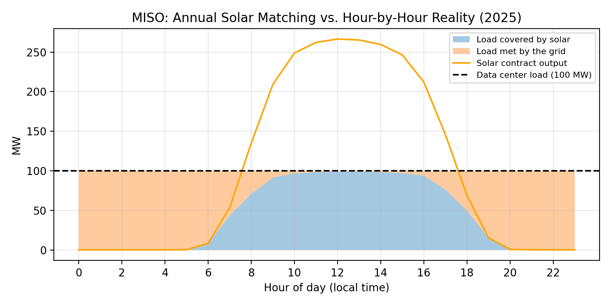
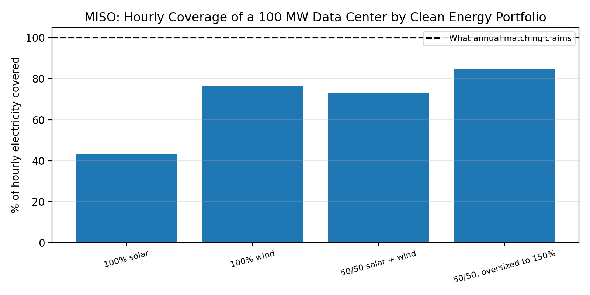
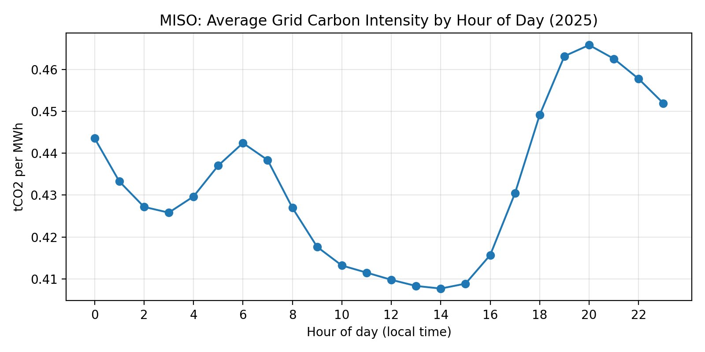
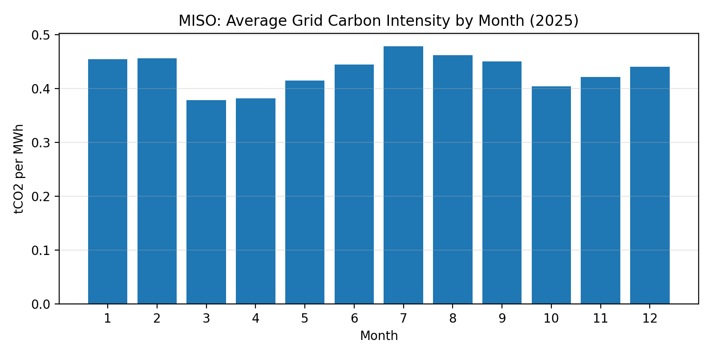

# The 24/7 Gap: Hourly Carbon Emissions of Data Centers in MISO

*Python (pandas, NumPy, matplotlib) · EIA-930 hourly grid data, 2025*

## Why I did this

Tech companies often say their data centers run on "100% renewable" energy. Usually
that means they buy enough clean power over a year to equal what the data center uses
in a year. But a data center runs every hour, including at night when solar produces
nothing. I wanted to know how much of a data center's electricity is actually matched
by clean power hour by hour, and how much of its emissions are left over.

This project builds on my earlier work on AI emissions reporting and a cost-benefit
analysis of Meta's data center in Louisiana, which is served by the MISO grid.

## How I did it

I used EIA-930 data, which reports hourly electricity generation by fuel for each US
grid region, and focused on MISO for 2025 (8,760 hours). For each hour, I estimated the
grid's carbon intensity by multiplying generation from each fuel by an approximate
emission factor based on EPA eGRID (coal 1.0, gas 0.4, oil 0.8 tCO2/MWh; nuclear,
hydro, wind, and solar 0).

I then modeled a hypothetical 100 MW data center running around the clock, which uses
876,000 MWh a year. I gave it clean energy contracts sized to cover its full annual
use, following MISO's real hourly solar and wind output, and checked hour by hour how
much of its load those contracts actually covered.

## What I found

Running on the MISO grid alone, the data center would emit about 378,000 tonnes of
CO2 a year.

With a solar contract large enough to claim "100% renewable," it was still only
covered 43% of the time on an hourly basis. About 58% of its emissions, around
220,000 tonnes, remained, mostly because solar produces nothing at night.

Wind did much better, covering 77% of hourly use, since MISO's wind often blows at
night. I expected a 50/50 mix of solar and wind to do best, but it actually came in
slightly below wind alone (73%). Replacing half the wind with solar mostly added more
power at midday, when there was already a surplus. Even when I oversized the 50/50
portfolio to 150% of annual use, it reached 85% coverage and still left 17% of
emissions. Closing that last gap would likely take storage or firm clean power.

Timing matters too. The MISO grid is cleanest around 1 to 3 pm and dirtiest around
7 to 9 pm. By season, it is cleanest in spring and dirtiest in July.

## Limitations

I used average grid emissions, not marginal emissions, so I'm not capturing which
power plant actually responds when demand goes up. I also didn't credit the extra
midday solar that flows back into the grid and displaces other generation. MISO-wide
wind output is smoother than a single wind farm's, so the wind results are an upper
bound. Finally, the emission factors are simplified and the analysis covers only
one year.

## What's next

I'd like to run the same analysis for PJM, which includes Northern Virginia's data
center hub, add battery storage to the portfolios, and switch to marginal emission
rates.

## How to run it

Open `datacenter_247_gap (1).ipynb` in Google Colab and select Runtime → Run all. The
notebook downloads the EIA-930 data directly from eia.gov.
